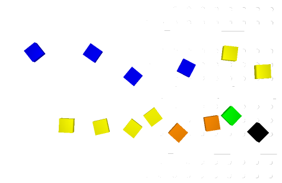

# robot-vision-pick-and-place
RoboDK simulation with robot and vision (2d) pick and place

### Vision To-Do

- [x] Color Segementation
- [x] Detection
- [x] Jupyter Visu
- [x] 3D Calibration
- [x] Connect with RoboDK Camera
- [x] Move Robot
- [x] Build Simpsons
- [x] Plug Everything together 

###

