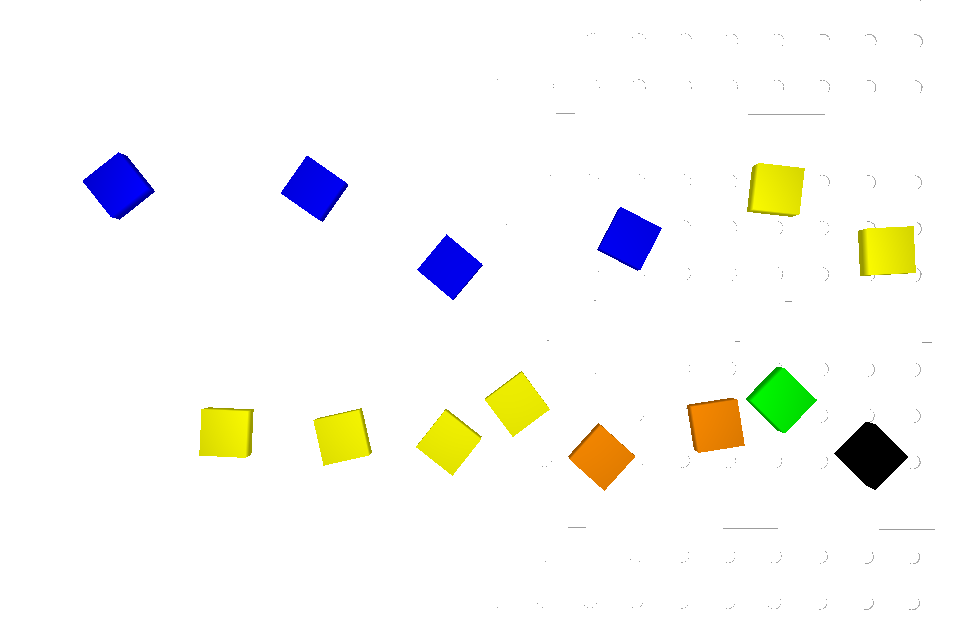
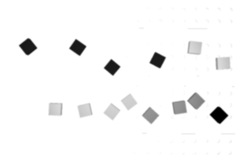
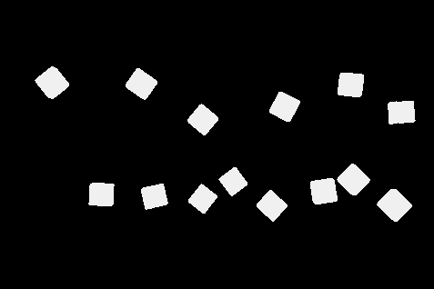
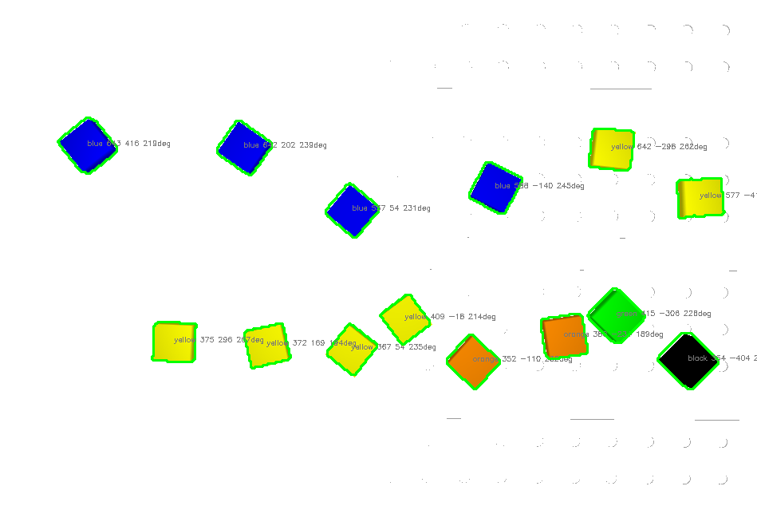
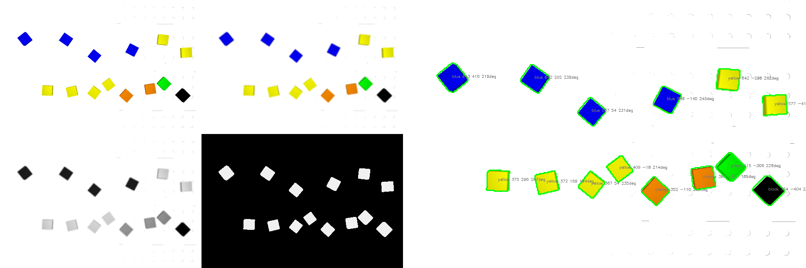
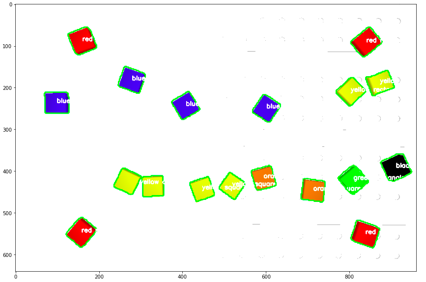

# robot-vision-pick-and-place
RoboDK simulation with robot and vision (2d) pick and place

### Vision To-Do

- [x] Color Segementation
- [x] Detection
- [x] Jupyter Visu
- [x] 3D Calibration
- [x] Connect with RoboDK Camera
- [x] Move Robot
- [x] Build Simpsons
- [x] Plug Everything together 

## Image Processing

### Camera Raw Image

### Scale Down Input

### Add Gaussian Blur

### Convert to Grayscale

### Inverted Binary Thresholding

### Trace Contours, Add Discrete Colors to each Contour Object, Estimate Polygon, Use Polygon Corners to Calculate Orientation, Use Homography Transform to get World Coordinates from Pixel Coordinates

### Full Visu

### Initial Calibration is being done by using 4 additional red bricks with knows world locations.

### Program in Action
https://user-images.githubusercontent.com/42101377/117690134-cd388980-b1ba-11eb-881e-b1d171341d41.mp4
https://www.youtube.com/watch?v=betZsiYEAE0

